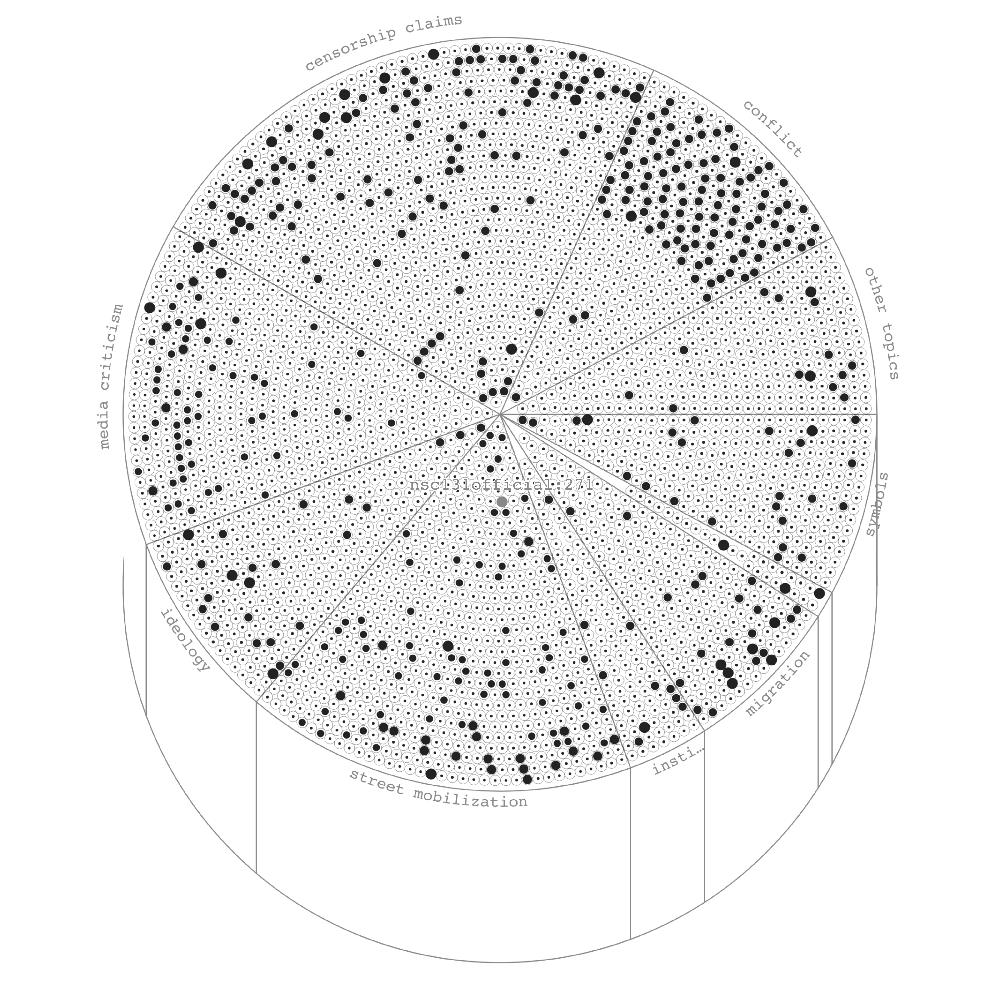

# Infrastructures of Extremism

Right-wing extremist organisations have gained visibility on European streets. During orchestrated demonstrations, in particular youth groups show banners that advertise Telegram channels as offline-to-online gateways into far right communities. This investigation takes these banners as its starting point to surface how they lead into a network of interconnected online communities as Infrastructures of Extremism.

--- 

- `notebooks/` — code to crawl and tag messages
- `app/` — the web app that displays the graphs
